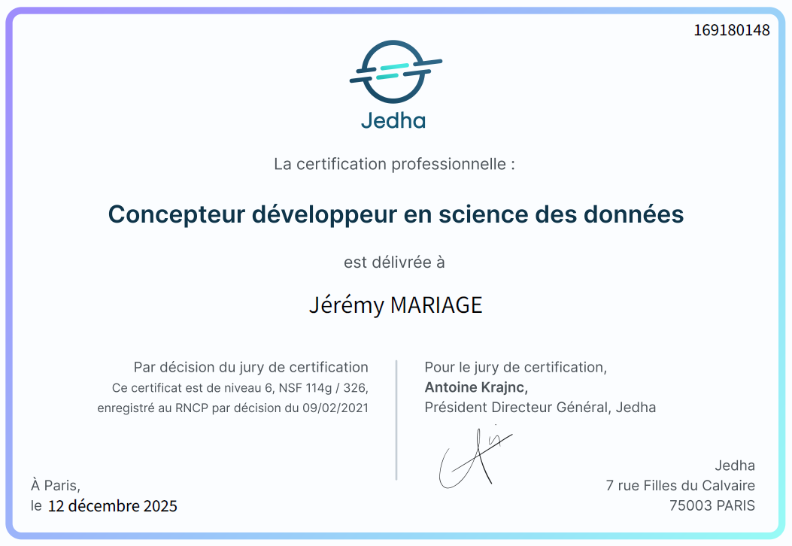
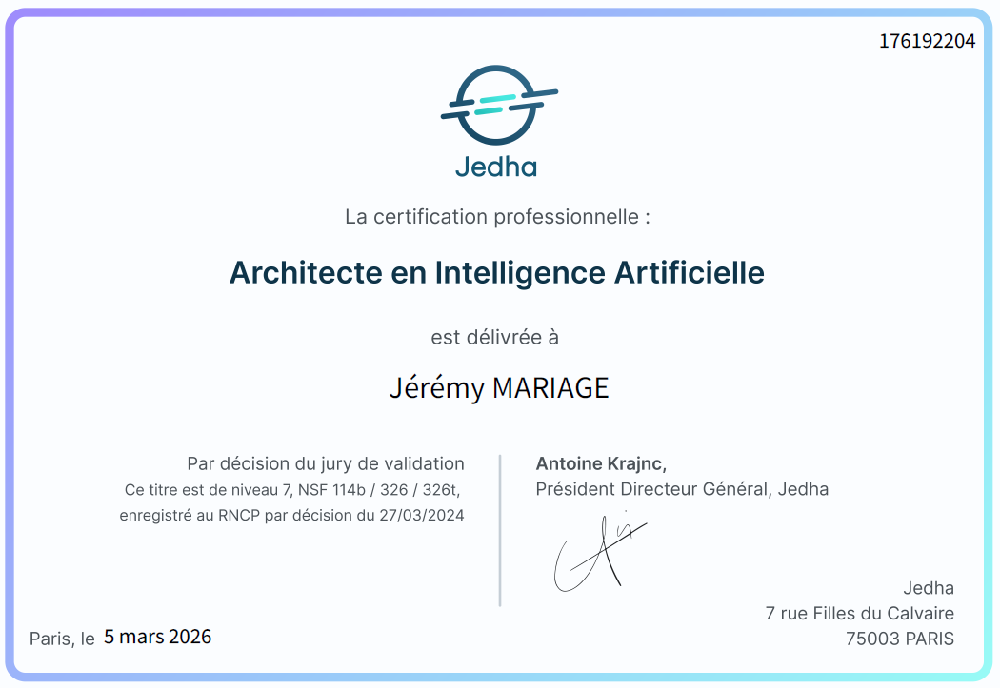

# :mortar_board: Education

Welcome to my education folder! You may find here both certificates officially assessing my education as being master level by :fr: French standards. Here are the two quicklinks to the certificates: [ML engineer](#bachelor-level---rncp-35288-ml-engineer) / [AI Architect](#master-level---rncp-38777-ai-architect)

You may find below the direct links to the relevant certificactes (please note the official website **does not** provide an official :uk: English translation):

* Bachelor level: [RNCP 35288 - ML engineer](https://www.francecompetences.fr/recherche/rncp/35288/)

* Master level: [RNCP 38777 - AI Architect](https://www.francecompetences.fr/recherche/rncp/38777/) (now registered as [RNCP 41993 - AI Architect](https://www.francecompetences.fr/recherche/rncp/41993/))

Since you may not be familiar with French education credentials, you may find a convenient "International area" within the official, public service of *France Compétences* to ask your questions through [this link](https://www.francecompetences.fr/international-en/?lang=en)!

# Bachelor level - RNCP 35288 ML engineer [:top:](#mortar_board-education)

# Master level - RNCP 38777 AI Architect [:top](#mortar_board-education)

